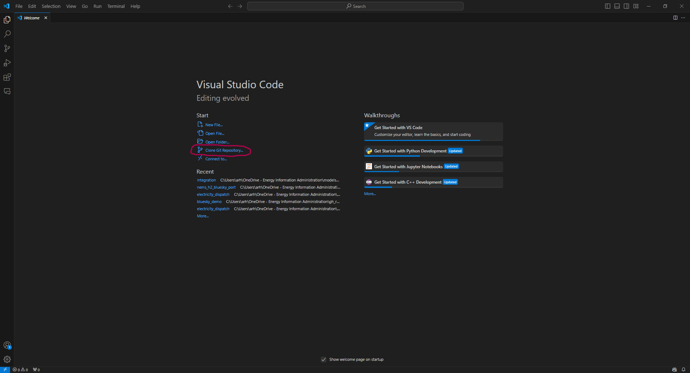

# BlueSky Prototype
### Table of Contents
- [Overview](#overview)
- [Setup](#setup)
- [Usage](#usage)
- [Documentation](#documentation)

&nbsp;
# Overview

[Project BlueSky](https://www.eia.gov/totalenergy/data/bluesky/) is an EIA initiative to develop an open source, next generation energy systems model, which will eventually be used to produce the Annual Energy Outlook ([AEO](https://www.eia.gov/outlooks/aeo/)) and International Energy Outlook ([IEO](https://www.eia.gov/outlooks/ieo/)). Our outlooks are focused on projecting realistic outcomes under a given set of assumptions, accounting for rapid technological innovation, new policy, changing consumer preferences, shifting trade patterns, and the real-world friction associated with the adoption of novel or risky technology. To address these challenges, the next generation model is designed to be modular, flexible, transparent, and robust. 

The BlueSky Prototype is the first step towards creating this next generation model. Our objective in releasing the prototype is to give the modeling community an early opportunity to experiment with the new framework and provide feedback. See the [contribution file](/CONTRIBUTING.md) for information on how to give feedback. 

Given current resource constraints, EIA has paused future Project BlueSky model development activity. Project BlueSky enabled EIA to explore new energy modeling approaches, and this foundational work will serve as a basis for EIA’s future long-term model development efforts as EIA continues to advance its energy modeling capabilities.

There are four key features associated with the BlueSky Prototype:

1. **A computationally efficient, modular structure that allows each sector to flexibly capture the underlying market behavior using different governing dynamics.** 
The protype contains three test modules representing electricity, hydrogen, and residential demand. Both the electricity and hydrogen models employ least-cost linear optimization as a governing dynamic, while the residential sector model adjusts demand levels based on prices from the other two sectors. The prototype includes an 'integrator' module that can either execute an individual module or combine the modules into a single nonlinear optimization problem [using two different methods](src/integrator/README.md). This feature will allow the next generation model to be **modular and flexible**.

2. **Well-documented Python code.** In the prototype, we have tried to write Python code that is easy to follow. We have included both detailed, high-level descriptions of each module in markdown, as well as code documentation using [Sphinx](https://www.sphinx-doc.org/en/master/), which we use to aggregate doc strings embedded in the code to create documentation. Most open-source models develop coding and documentation styles prior to their initial release. Even for models that are easy to apply, the underlying code and documentation are not always clear. We are inviting the community to provide feedback at this early stage so that code and documentation developed for the production version are as transparent as possible. This feature will allow the next generation model to be **transparent**.

3. **An example data pipeline documented with Snakemake.** Energy system models are data intensive and require a multitude of data transformations to convert raw data from a known source into formatted model input data. We are experimenting with [Snakemake](https://snakemake.readthedocs.io/en/stable/), a tool that allows us to create a well-documented data management framework to organize, pre-process, and post-process model data. In the prototype, Snakemake is used in a standalone application to create a geospatial crosswalk involving both electricity operations and weather data. We are considering the use of Snakemake across the model to comprehensively manage input data. This feature will allow the next generation model to be **transparent**. 

4. **Two methods to characterize model sensitivity.** One method uses an efficient way to approximate derivatives of model outputs with respect to inputs for systems of nonlinear equations using complex variables ([Lai et al., 2005](https://arc.aiaa.org/doi/abs/10.2514/6.2005-5944)). The method is broadly applicable to any module where the equations are continuously differentiable and has been implemented in applications beyond energy modeling. A second method is directly applicable to convex optimization problems and applies approximation methods for sensitivity analysis on optimization models ([Castillo et al., 2006](https://link.springer.com/article/10.1007/s10957-005-7557-y)). These methods will allow us to ensure **robust** model results by testing model sensitivity. Additional methods to quantify model sensitivity and uncertainty will be implemented in the future. 


The BlueSky Prototype is focused on demonstrating the four features above. The feedback gathered from community experimentation will be used to improve future versions of the next generation model. Given the prototype's limited scope, it does NOT provide results that are relevant to the real world. To emphasize this point, we have omitted any reference to a specific country, region, or timeframe in the input data.

&nbsp;
# Setup

Follow these steps to set up and run the BlueSky Prototype model.

### Prerequisites
To set up the appropriate Python environment, you will need to install the following:
* Anaconda (or Miniconda 3)
* Python (version 3.12)
* Git Bash 
* Visual Studio Code or preferred integrated development environment (IDE) (optional)

### Steps
1. [Clone the Bluesky repository](#clone-the-bluesky-repository)
2. [Set up the environment](#setup-environment-with-anaconda-prompt)

### **Clone the BlueSky repository**

Clone the BlueSky GitHub repository to your local computer. See the tabs below for instructions using Git or VS-Code.

#### **Clone with git**
<details>

## Prerequisites

**Git**: Ensure that you have Git Bash installed on your machine. You can download it from [git-scm.com](https://git-scm.com/).

## Steps to Clone a Repository

1. **Open Your Terminal or Command Prompt**:
   - On **Windows**, you can use Git Bash or Command Prompt.
   - On **macOS** or **Linux**, open the Terminal.


2. **Navigate to Your Desired Directory**:
   Use the `cd` command to change to the directory where you want to clone the repository. For example:

   ```bash
   cd path/to/your/directory
   ```

3. **Get the Repository URL**:
   - Go to the GitHub repository page you want to clone.
   - Click on the **Code** button, then copy the repository URL (either HTTPS or SSH).

4. **Clone the Repository**:
   Use the `git clone` command followed by the repository URL. For example:
   ```bash
   git clone https://github.com/username/repository.git
   ```
   or if using SSH:
   ```bash
   git clone git@github.com:username/repository.git
   ```

5. **Access the Cloned Repository**:
   After cloning, navigate into the repository folder:

   ```bash
   cd repository
   ```

## Additional Notes

- If you're using HTTPS, you may be prompted to enter your GitHub username and password.

</details>

#### **Clone with Visual Studio Code**
<details>

## Prerequisites

**Visual Studio Code**: Ensure that you have VS-Code installed on your machine. 

## Steps to Clone a Repository using Visual Studio Code

1. Open VS-Code and **click** `Clone Git Repository` *circled below in $`\textcolor{red}{\text{RED}}`$ 



2. Paste the repository link into the search bar when prompted and hit **ENTER** *circled below in $`\textcolor{red}{\text{RED}}`$

```bash 
https://github.com/EIAgov/BlueSky.git
```


3. The *File Explorer* should pop up and ask where you would like to save the cloned repository. 

4. **Click** on the folder destination and hit save. 

The repository will be cloned to your specified location. 

</details>


### **Setup Environment with Anaconda Prompt**

1. **Open Anaconda Prompt**

   Launch the Anaconda Prompt to begin the setup process.


2. **Navigate to the Working Directory**

   Use the `cd` command to navigate to the working directory for the BlueSky Prototype. For example:

   ```bash
   cd path\to\your\BlueSkyPrototype
   ```

3. **Run the Environment Creation Script**

   > **Conda channel warning**
   >
   > Recent versions of Conda print a warning about implicitly adding the
   > `defaults` channel. If you see this message when creating or updating
   > the environment, run `conda config --add channels defaults` once to set
   > the channel explicitly.

   Note: if you have already run this script, you must instead update the environment. Go to step 4 for more information.

   For **Windows**, run the batch file to set up the Conda environment:

   ```bash
   envs\env-setup.bat
   ```

   On **Linux** or **macOS**, run the contents of the bat file in Terminal.

   ```bash
   conda env create -f envs/conda_env.yml && conda activate bsky
   ```

   This will create and set up the necessary Conda environment for the project.

4. **Update the Environment**

   The update from BlueSky version 1.0 to 1.1 has several package changes that will require an environment update. To update an environment that already exists, run the following:

   ```bash
   conda env update --f envs/conda_env.yml  --prune
   ```

   We are aware of some conda issues where this may throw errors and not correctly update. In this case, run the following to re-create the environment from scratch:

   ```bash
   conda env create --f envs/conda_env.yml  --yes
   ```


#### Setup Instructions with *Screenshots*
<details>
   <summary> Click to expand setup instructions </summary>

   ## Steps

1. **Open Anaconda Prompt**

   Launch the Anaconda Prompt to begin the setup process.


2. **Navigate to the Working Directory**

   Use the `cd` command to navigate to the working directory for the BlueSky Prototype. For example:

   ```bash
   cd path\to\your\BlueSkyPrototype
   ```


3. **Run the Environment Creation Script**

   On **Windows**, run the batch file to set up the Conda environment:

   ```bash
   envs\env-setup.bat
   ```

   This will create and set up the necessary Conda environment for the project.


</details>

&nbsp;
# Usage
The BlueSky Prototype can be executed either through the Streamlit app that provides a graphical user interface (GUI), or run from the command line. All scripts should be run from the top-level directory of the project via the app or ```main.py``` file, as explained below. 

Note that the Prototype can be run with different configuration options to indicate the modules, regionality, temporal resolution, solver options, and other module-specific settings. These options are encoded in [```run_config.toml```](src/common/run_config.toml). When running the model from the command line, ```run_config.toml``` must be modified directly and contains detailed descriptions of the configuration settings. When running the model from the GUI, the same configuration options can be set via the interface without accessing the file directly. For GUI users, the configuration options are described in detail [here](#streamlit-app-features).

One of the key features of the BlueSky Prototype is the ability to run modules individually or select between two solve options for the integrated runs. The table below describes the different modes when running the model. More details on these methods can be found in the [Integrator README](src/integrator/README.md).

|Mode   | Methods File   | Demonstrates |
|:----- | :------: | :--------- |
| standalone | [```runner.py```](src/integrator/runner.py) | Apply a unified (single optimization) method to one of the modules (Electricity, Hydrogen, Residential) |
| gs-combo | [```gaussseidel.py```](src/integrator/gaussseidel.py) |  Apply an iterative (Gauss-Seidel) method to 3-way combination of modules (Electricity, Hydrogen, Residential) |
| unified-combo | [```unified.py```](src/integrator/unified.py) | Apply a unified (single optimization) method to 3-way combination of modules (Electricity, Hydrogen, Residential)


### Ways to Run the Model
* [Run Model with Streamlit App GUI](#streamlit-app-graphical-user-interface-gui-steps)
* [Streamlit App Features Description](#streamlit-app-features)
* [Run Model in the Command Prompt](#command-prompt-steps)


<!---Below is a video which goes through how to set up to create your own runs. This video goes over how to set up the temporal and spatial resolution of your runs, any additional switches to configure the electricity model, how to select run modes, and the expected output after a run is complete.


-->
### Streamlit App Graphical User Interface (GUI) Steps

1. **Open Anaconda Prompt**

   Launch the Anaconda Prompt to begin the setup process.


2. **Navigate to the Working Directory**

   Use the `cd` command to navigate to the working directory for the BlueSky Prototype. For example:

   ```bash
   cd path\to\your\BlueSky
   ```

3. **Run the Streamlit App**

   To launch the BlueSky Prototype app, use the following command:

   ```bash
   streamlit run app.py
   ```

   On Windows you can use the helper script:

   ```bash
   .\run_streamlit_app
   ```

   This will start the Streamlit application.


4. **Access the Web Interface**

   - Once the app is running, a web browser should automatically open.
   - If the GUI doesn’t show up immediately, refresh the browser page.

You're all set! The BlueSky Prototype model should now be running, and you can interact with it through the browser interface.


#### Usage Instructions with *Screenshots*
<details>
   <summary> Click to expand usage instructions </summary>

   ## Steps

1. **Open Anaconda Prompt**

   Launch the Anaconda Prompt to begin the setup process.


2. **Navigate to the Working Directory**

   Use the `cd` command to navigate to the working directory for the BlueSky Prototype. For example:

   ```bash
   cd path\to\your\BlueSkyPrototype
   ```


3. **Run the Streamlit App**

   To launch the BlueSky Prototype app, use the following command:

   ```bash
   streamlit run app.py
   ```

   On Windows you can use the helper script:

   ```bash
   .\run_streamlit_app
   ```

   This will start the Streamlit application.


4. **Access the Web Interface**

   - Once the app is running, a web browser should automatically open.
   - If the GUI doesn’t show up immediately, refresh the browser page.


You're all set! The BlueSky Prototype model should now be running, and you can interact with it through the browser interface.

</details>

### Streamlit App features


#### Streamlit Features description

1. The **sidebar configuration** area lets you reuse the default configuration or upload a custom `run_config.toml`, preview the years available for simulation, and toggle carbon policy options such as reserve price floors, CCR tranches, and banking rules.

2. **Assumption override tabs** expose editable demand, unit, fuel, and transmission tables. You can adjust values directly inside Streamlit or upload CSV files to replace the defaults before executing a run.

3. A **run summary and confirmation** panel presents the selected inputs and requires explicit confirmation before launching the simulation, helping prevent accidental long-running jobs.

4. After completion, the **results panel** displays run metadata, notes, and download buttons for each generated CSV so you can retrieve outputs without leaving the browser.

5. Streamlit session state preserves temporary directories and recent run results during your session, making it easy to revisit outputs or clear them before starting a new scenario.

To revert to the default assumptions, refresh the browser or reload the default configuration file.

#### Dash GUI debug mode (development only)

The Dash-based GUI defined in [`gui/dash_app.py`](gui/dash_app.py) now keeps the
Dash server's debug functionality disabled by default to avoid exposing the
interactive debugger in any shared or production deployment. Debug mode must
**never** be enabled in production environments because it allows arbitrary code
execution through the Werkzeug debugger.

Developers who need the automatic reloader or live debugger locally can opt in
by setting the `BLUESKY_DASH_DEBUG` environment variable before launching the
app:

```bash
# Linux or macOS
export BLUESKY_DASH_DEBUG=1
python gui/dash_app.py

# Windows (PowerShell)
$Env:BLUESKY_DASH_DEBUG = 1
python gui/dash_app.py
```

Unset the variable or set it to any other value when you are done debugging to
return to the secure default behavior.

### Command Prompt Steps
See the tab below for instructions on how to run the model using the command prompt.

<details>

Be sure to have the 'bsky' environment activated in a terminal, navigate to the 'BlueSky' directory in your terminal, and then run the following code:

```bash
python main.py --help
```

This should return a description of ```main.py```, as well as the options available within the command line interface. Now, check to see if we can run and solve a model by executing:

```bash
python main.py --mode standalone
```

By default, results are written to your operating system's **Downloads** directory inside a `GraniteLedger` subfolder. Each run creates a folder named after the selected mode and a hash of the configuration (for example, `~/Downloads/GraniteLedger/standalone_a1b2c3d4`). You can override the folder name with the command-line option below or by setting `output_name` in `run_config.toml`:

```bash
python main.py --mode standalone --output-name my_custom_run
```

If the specified directory already exists, an incremental suffix (e.g., `_01`) is appended to prevent accidental overwrites.

If this reports an objective value, you have successfully run the model in standalone!

The file [```main.py```](main.py) processes user options as directed by the configuration file [```run_config.toml```](src/common/run_config.toml) and builds/solves an instance of an integrated (multiple modules) or standalone (single module) model. Any runs initiated from the top level ```main.py``` file will initiate logging and write results to the Downloads location described above. The log file contains (currently very limited) updates on run progress, solver output, etc. The default logging level is INFO. That may be increased by setting the command line argument --debug when running main.py.

It is also possible to set the option for ```default_mode``` in ```run_config.toml```. Then, run ```main.py``` without specifying a mode: 

```bash
python main.py
```

</details>

&nbsp;
## Documentation
Documentation for each of the modules is available using the links below. We also include documentation for other products within the repository, including a sample data workflow tool, a sample unit test setup, and a sample output data viewer.

* [Integrator Module](src/integrator/README.md)
* Electricity Module
   - [Model](src/models/electricity/README.md)
* Hydrogen Module
   - [Model](src/models/hydrogen/README.md)
   - [Preprocessor](src/models/hydrogen/README.md)
* Residential Module
   - [Model](src/models/residential/README.md)
   - [Preprocessor](src/models/residential/preprocessor/README.md)
* [Sensitivity](src/sensitivity/README.md)
* [Data Workflow](sample/data_pipeline/README.md)
* [Unit Tests](unit_tests/README.md)

Users can access code documentation following these [instructions for HTML, Markdown, and PDF documentation](docs/README.md). Alternatively, code documentation can be generated by the user within the GUI by clicking the 'code documentation' button, which will run Sphinx locally and generate an html file in your open browser. See the instructions on working with the GUI for more details 

### Support
See the [contribution file](/CONTRIBUTING.md) for information on feedback. Please reach out to BlueSky team for assistance: nextgenerationmodel@eia.gov  

### Authors
U.S. Energy Information Administration

### License
The BlueSky code, as distributed here, is governed by the [Apache 2.0 license](https://github.com/eiagov)

### Project status
In April 2025, EIA released Version 1.1 of the Project BlueSky prototype model.  Given current resource constraints, EIA will pause future Project BlueSky model development activity. Project BlueSky enabled EIA to explore new energy modeling approaches, and this foundational work will serve as a basis for EIA’s future long-term model development efforts as EIA continues to advance its energy modeling capabilities.
