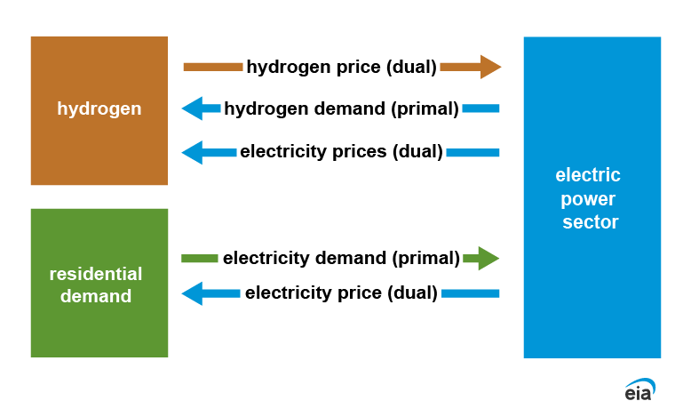
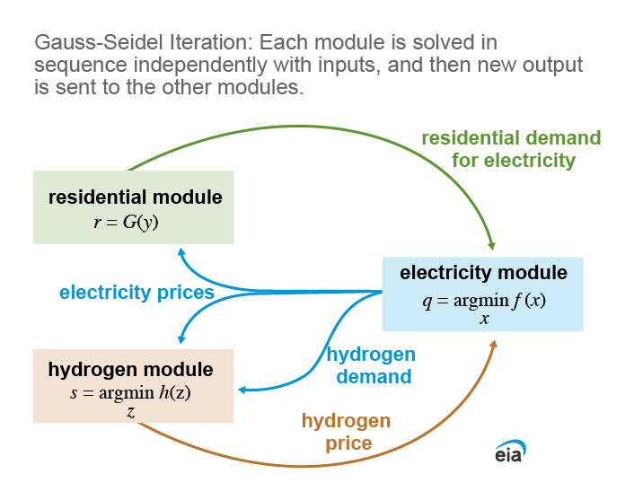
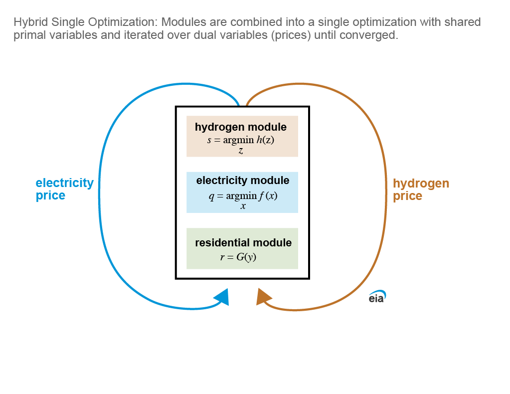

# Integration

### Table of Contents
- [Introduction](#introduction)
- [Model Overview](#model-overview)
- [Prepare Data](#prepare-data)
- [Code Documentation](#code-documentation)

## Introduction

Finding an equilibrium solution among several modules requires exchanging information that is common between modules and/or having modules access information contained in another module. The Prototype chooses to find an equilibrium solution through this integrator module. 

The essential common information that modules exchange is related to prices and quantities, which have to coincide among the modules for an equilibrium. Modules might exchange other information, such as updated marginal costs and discount rates, but mathematically, there's two types of variables exchanged between modules: 

1) **Primal Variables**, or those that explicitly are defined within the problem, and exist as unknowns that the problem solves for. This mostly include quantities. 

2) **Dual Variables**, or those outputs available once the problem is solved but are not explicitly defined in the problem formulation. Examples of this are prices that are calculated from multipliers or shadow prices of market clearing conditions in individual modules. 

**The Prototype shows generalizable methods to exchange both these pieces of information under two different methods to solve for an equilibrium.** While the Prototype only displays specific examples, they are programmed in a generalized way so that modules can exchange any primal and dual variables within modules. The "Primal" and "Dual" terminology is borrowed from mathematical optimization but can apply to any module depending on how the variables are defined. Note that any parameters could be exchanged as primal variables. 

This module provides computational methods to integrate the sectoral modules and solve for equilibrium. The module exchanges prices (Dual Variables) and quantities (Primal Variables) as in the figure below until values converge. 

## Model Overview

The prototype has two different methods to solve for equilibrium, the iterative Gauss-Seidel and the unified single optimization method. 

Mathematically, if both methods converge, the point they converge to is guaranteed to be an equilibrium. In our integrator methods, the Hydrogen demand is a primal variable, and in the unified optimization method, is coded as a variable that is shared in the overall problem. The Hydrogen price and Electricity price are dual variables and are only available after the optimization has been solved. The problem needs to be resolved with the updated dual variables until it converges. Other primal and dual variables that are common between modules can be coded by the methodology presented here.

### Iterative Gauss-Seidel Method

A [Gauss-Seidel](https://en.wikipedia.org/wiki/Gauss%E2%80%93Seidel_method) iteration method mimics the current NEMS algorithm in a basic manner. The modules are **solved iteratively with variables from other modules fixed as parameters until all modules converge**. The unified single optimization method  combines all modules into a single optimization problem and **then iterates over dual variables until the values of the dual variables converge**.

### Unified Single Optimization Method

A unified single optimization method that combines all modules into a single optimization problem and then iterates over dual variables until the values of the dual variables converge.

## Prepare Data

### Run Configuration 

The majority of the options for integrating and solving modules rely upon a configuration file located in the common folder: run_config.toml. This file contains settings shared across modules as well as settings specific to each module. 

#### Integrator Settings

|Switch | Description   | Values     | Notes |
|:----- | :-----------: | :--------- | :---- |
|force_10 | Forces 10 iterations to occur when running combo solves | **false** = Off   **true** = On| Only allows for true/false options, does not impact H2 or elec modes |
| tol | Tolerance setting for iterative solves | $tol \in (0, 1)$| Represents the acceptable percent difference in objective values between iterative solves needed to achieve convergence
| max_iter | Maximum number of iterations allowed | $int$ | If tolerance criteria is not met, iterative solves will stop +1 solve after max_iter
| sw_temporal | Temporal resolution (inter-annual) switch | **default** = 16 representative (rep) days and 4 rep hours   **d8h12** = 8 rep days and 12 rep hours   **d4h24** = 4 rep days and 24 rep hours   |Temporal switch to select different prespecified temporal resolutions. Advanced users can also specify their own temporal resolution by creating their own “cw_s_day” and “cw_hr” files in the “src\integrator\input\temporal_mapping” directory. See more details below in the temporal settings section

#### Temporal Settings

The model runs a number of representative days (self-looping) with a number of periods (hour-several hours) per representative day. Any number of aggregated representative days can be used, but there must be at least 1 per season. The representative days and hours use a weighted average of inputs where necessary.

| Temporality | File | Description |
| :---------- | :--- | :---------- |
| Hours | cw_hr.csv | **Contains the representative hour mapping crosswalk**   <li> Index_hour represent each hour in a 24 hour period   <li> Map_hour is the representative hour number each Index_hour is being mapped to. Hours must be in chronological order.   <li> Map_hour 1 can wrap around from 24 to 1. |
| Days | cw_s_day.csv | **Contains the representative hour mapping crosswalk**   <li> Index_day is the day number of the year: 1-365   <li> Map_s is the season mapping of these days. *Note: Do not change this unless you need to make larger changes to the code because input files are based on the seasons*   <li> Map_day is the representative day that this Index_day is mapped to. Representative days are created using weighted averages of Index_day. *Note: You cannot have a representative day span multiple seasons.* |
| Years | sw_year.csv | **Contains the representative year mapping switches**   <li> Points to a csv file that contains switches for years being run. Runs the models for the years that are switched on, e.g., **1** = On   <li> If **sw_agg_year** in the toml file is also tuned on, the representative year will be an average of all of those before it (until the previous year switched on). This also properly weights the years. Otherwise, it only runs the years that are switched on. 

#### Spatial Settings
This model currently has 25 regions. Turning on and off certain regions allows only specific regions to be run.

| Regionality | File | Description |
| :---------- | :--- | :---------- |
|Regions | Region helper registry | **Uses the canonical region helper registry**   <li> Select region identifiers from ``regions.REGIONS``. The matching ``regions.REGION_HELPERS`` entries expose helper utilities for each configured region.|

*Note: Hydrogen data currently has hydrogen production in Region 7 (only) for demonstration.  Simple modifications to the data could expand this.  Most of the instantiations of the Hydrogen model use the 'single_region' data folder in the H2 module*

#### Model-Specific Settings

For more details about the module-specific settings provided in the configuration file, navigate to the model READMEs (e.g., [Electricity](/src/models/electricity/README.md), [Residential](/src/models/residential/README.md), [Hydrogen](/src/models/hydrogen/README.md)).

## Code Documentation

Navigate to the docs README for details on code documentation, as well as instructions for locally compliling Sphinx to generate an html version of the documenation.

[Code Documentation](/docs/README.md)